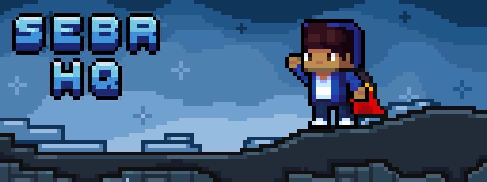
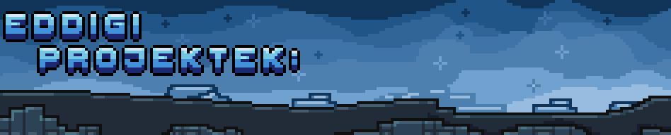

<h1 align="center">
Üdvözöllek a GitHub profilomon!
</h1>
<b>Szia!</b> Sebi vagyok, ismertebb nevemen Sebi. Jelenleg Szoftverfejlesztő és -tesztelő szakon tanulok egy 5 éves technikumban. Eddig nagyon nem kedveltem a githubot, de úgy döntöttem elkezdem használni, és eléggé megtetszett. Örülök, hogy meglátogattad a profilomat, remélem valami tetszeni fog!

 - KáoszCraft
 - Mesterfokon Klub
 - MesterMusic
 - Rakkel
 - FlameClub/GalaxyVision

Jelenleg a sulimnak készítek egy minecraft szervert, hogy promotáljuk az iskolát :DD

*Tervben hamarosan több :3*

🌟💓Egy csillagot elfogadok 💓🌟 
The end

